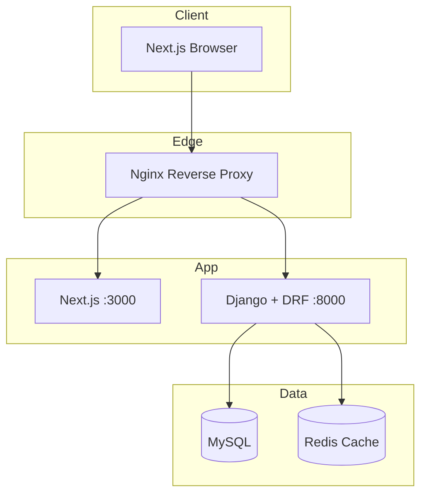

# System Architecture

## Overview

The Job Board is a **monorepo** with a decoupled **REST API** (Django) and **SPA** (Next.js). Clients authenticate with **JWT**; the API enforces **role-based permissions** for recruiters vs job seekers.



## Backend Architecture

### Layered design

```
HTTP Request
    → URL routing (config/urls.py)
    → DRF View / ViewSet
    → Serializer (validation + representation)
    → Permission classes (RBAC)
    → Service / queryset (ORM + cache)
    → Response
```

### Django apps (domain-driven)

| App | Responsibility |
|-----|----------------|
| `accounts` | Custom user, profile, register/login/refresh/logout |
| `companies` | Company entity linked to recruiters |
| `jobs` | Job CRUD, listing, search, filter, saved jobs |
| `applications` | Apply, applicant list, status updates |

### Settings split

- `config/settings/base.py` — shared config
- `config/settings/development.py` — debug, local DB
- `config/settings/production.py` — security headers, production DB

### Cross-cutting concerns

| Concern | Implementation |
|---------|----------------|
| Authentication | `rest_framework_simplejwt` |
| Authorization | Custom DRF permissions per role |
| Pagination | `PageNumberPagination` (default page size 20) |
| Filtering | `django-filter` |
| Search | `SearchFilter` on title, description, company name |
| Sorting | `OrderingFilter` |
| Rate limiting | DRF `AnonRateThrottle` / `UserRateThrottle` |
| Caching | Redis via `django-redis` on job list endpoints |
| API docs | `drf-spectacular` |

## Frontend Architecture

```
src/
├── app/              # App Router pages (jobs, auth, dashboard)
├── components/       # UI components (JobCard, Navbar, forms)
├── lib/              # API client (axios/fetch + JWT refresh)
├── hooks/            # useAuth, useJobs
└── types/            # TypeScript interfaces mirroring API
```

- **Server state**: fetch from Django API; store JWT in httpOnly cookies or secure storage (implementation in later phases).
- **Styling**: Tailwind utility classes; mobile-first breakpoints.

## Security model

1. **Register/Login** returns access + refresh tokens.
2. **Access token** (short-lived) sent as `Authorization: Bearer <token>`.
3. **Refresh** endpoint rotates access token; **logout** blacklists refresh token (Simple JWT blacklist).
4. **Recruiter-only** endpoints: `IsRecruiter` permission.
5. **Job seeker-only** endpoints: `IsJobSeeker` permission.
6. Object-level: recruiters may only mutate jobs they own (via company).

## Caching strategy (Phase 6)

- **Endpoint:** `GET /api/v1/jobs/` (not `?mine=1`)
- **Backend:** Redis via `django-redis` (LocMem in local dev)
- **Key:** `jobs:list:v{version}:{public|seeker:id}:{query_hash}`
- **TTL:** `JOBS_LIST_CACHE_TTL` (default 300s)
- **Invalidation:** version counter incremented on job create/update/delete (API + admin signal)

## Deployment topology (AWS EC2)

```
Internet → Nginx (443) → Gunicorn (Django) + Node (Next.js build)
                      → MySQL (RDS or EC2)
                      → Redis (ElastiCache or EC2)
```

See [DEPLOYMENT.md](DEPLOYMENT.md) for step-by-step instructions.
