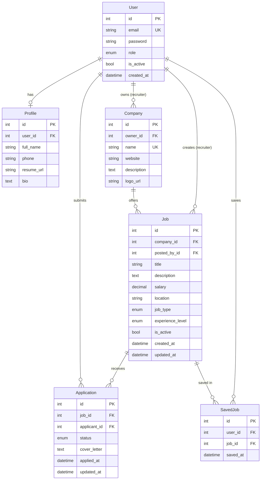

# Database Schema (Design)

Optimized relational schema for MySQL. Implementations live in Phase 2 Django models.

## ER Diagram

## Tables

### `accounts_user`

Custom user model (`AbstractBaseUser` + `PermissionsMixin`).

| Column | Type | Notes |
|--------|------|-------|
| id | BIGINT PK | Auto |
| email | VARCHAR(255) UNIQUE | Login identifier |
| password | VARCHAR(128) | Hashed |
| role | ENUM | `recruiter`, `job_seeker` |
| is_staff | BOOL | Admin access |
| is_active | BOOL | Soft disable |
| date_joined | DATETIME | |

**Indexes:** `email`, `role`

### `accounts_profile`

| Column | Type | Notes |
|--------|------|-------|
| id | BIGINT PK | |
| user_id | FK → user | One-to-one |
| full_name | VARCHAR(255) | |
| phone | VARCHAR(20) | Optional |
| resume_url | VARCHAR(500) | Optional |
| bio | TEXT | Optional |

### `companies_company`

| Column | Type | Notes |
|--------|------|-------|
| id | BIGINT PK | |
| owner_id | FK → user | Recruiter |
| name | VARCHAR(255) | Indexed |
| website | VARCHAR(255) | |
| description | TEXT | |
| logo_url | VARCHAR(500) | Optional |

**Indexes:** `owner_id`, `name`

### `jobs_job`

| Column | Type | Notes |
|--------|------|-------|
| id | BIGINT PK | |
| company_id | FK | |
| posted_by_id | FK → user | |
| title | VARCHAR(255) | Searchable |
| description | TEXT | Searchable |
| salary | DECIMAL(12,2) | Nullable |
| location | VARCHAR(255) | Filterable |
| job_type | ENUM | full_time, part_time, contract, remote, hybrid |
| experience_level | ENUM | entry, mid, senior, lead |
| is_active | BOOL | Default true |
| created_at | DATETIME | Sort default |
| updated_at | DATETIME | |

**Indexes:** `(is_active, created_at)`, `company_id`, `location`, `job_type`, `experience_level`

### `applications_application`

| Column | Type | Notes |
|--------|------|-------|
| id | BIGINT PK | |
| job_id | FK | |
| applicant_id | FK → user | Job seeker |
| status | ENUM | pending, reviewed, shortlisted, rejected, hired |
| cover_letter | TEXT | Optional |
| applied_at | DATETIME | |
| updated_at | DATETIME | |

**Unique:** `(job_id, applicant_id)` — one application per job per user

### `jobs_savedjob`

| Column | Type | Notes |
|--------|------|-------|
| id | BIGINT PK | |
| user_id | FK | |
| job_id | FK | |
| saved_at | DATETIME | |

**Unique:** `(user_id, job_id)`

## Query optimization notes

- Job list: `select_related('company', 'posted_by')`
- Applicant list: `prefetch_related('applicant__profile')`
- Saved jobs: `select_related('job__company')`
