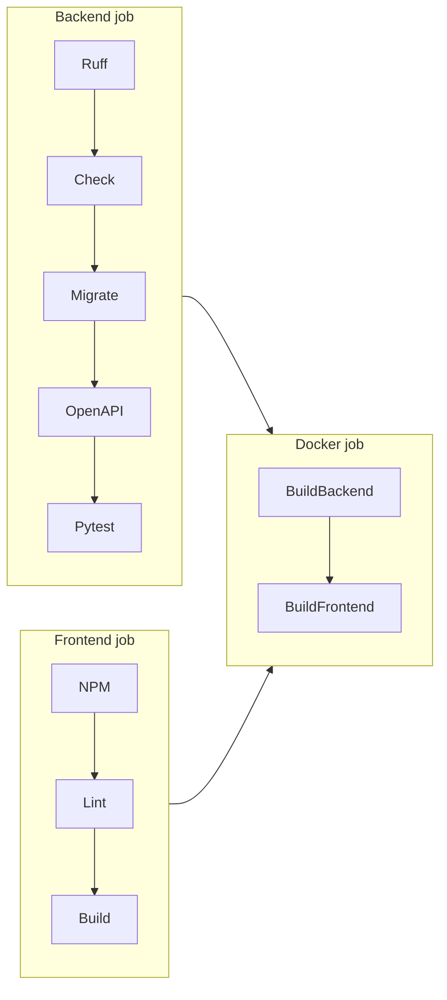

# Phase 9 — GitHub Actions CI/CD

## Workflows

| File | Trigger | Purpose |
|------|---------|---------|
| `.github/workflows/ci.yml` | Push, PR, manual | Lint, test, build |
| `.github/workflows/deploy.yml` | Push to `main`, manual | Deploy to EC2 via SSH |

## CI pipeline (`ci.yml`)



### Backend job
- **Services:** MySQL 8, Redis 7 (matches production stack)
- Ruff lint
- `manage.py check --deploy`
- Migrations
- OpenAPI schema validation (`--fail-on-warn`)
- Pytest (auth, jobs, applications)

### Frontend job
- `npm ci` → `npm run lint` → `npm run build`

### Docker job (after backend + frontend pass)
- Builds backend and frontend images with GitHub Actions cache

## CD pipeline (`deploy.yml`)

Deploys to EC2 when:
- Code is pushed to `main`, or
- You run **Actions → Deploy → Run workflow** manually

### Required GitHub secrets

| Secret | Example | Description |
|--------|---------|-------------|
| `EC2_HOST` | `3.15.1.2` | EC2 public IP or domain |
| `EC2_USER` | `ubuntu` | SSH user |
| `EC2_SSH_KEY` | `-----BEGIN OPENSSH...` | Private key (PEM) |
| `EC2_PORT` | `22` | Optional SSH port |
| `EC2_APP_DIR` | `/opt/job-board` | Optional app path on server |

Configure under **Settings → Secrets and variables → Actions**.

### GitHub environment (recommended)

Create environment `production` with:
- Required reviewers (optional)
- Environment secrets (same as above)

## Run CI locally

```bash
# Backend (needs MySQL + Redis or use SQLite for quick test)
cd backend
pip install -r requirements/dev.txt
pytest
ruff check .
python manage.py spectacular --validate --fail-on-warn

# Frontend
cd frontend
npm ci && npm run lint && npm run build
```

## Branch triggers

CI runs on:
- `main`, `master`
- `cursor/**` feature branches
- All pull requests

## Next phase

Phase 10 — AWS EC2 deployment guide (server setup, secrets, TLS).
